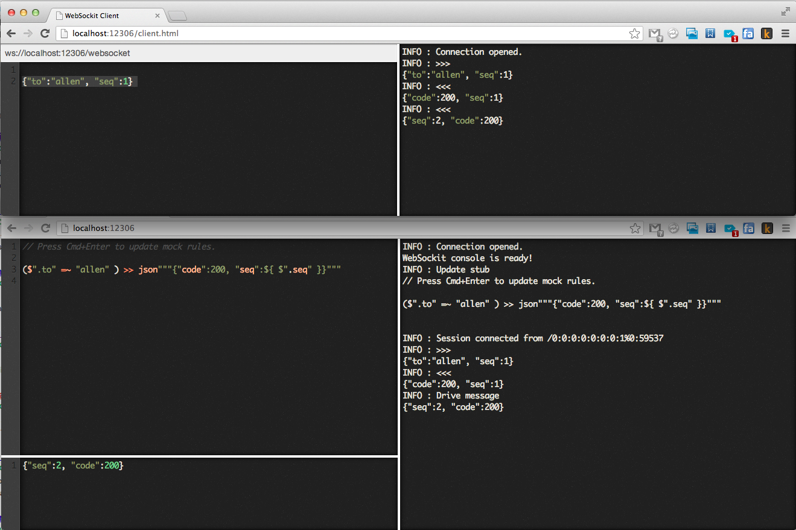

**websockit** provide stub and driver for testing [WebSocket](http://www.websocket.org) applicaiton.

## Install

### Install

- install [SBT](http://www.scala-sbt.org/release/docs/Getting-Started/Setup.html)

- clone [websockit](https://github.com/zhongl/websocket-kit)

```
> git clone git@github.com:zhongl/websockit.git
```

## Usage

- start websockit server

```
> cd websockit
> sbt run
```

- start websockit server at special port

```
> sbt "run 12306"
```

- `ws://localhost:12306/websocket` should be the url for your application to connect.

- use workbench page, click <http://localhost:12306>
    - left-top panel can update mock rules, press `Cmd|Ctrl + Enter` to submit
    - left-bottom panel can drive a message to your websocket client, press `Cmd|Ctrl + Enter` to submit
    - right panel is a console, which could display all the operation logs.



## Mock Rule Syntax

Suppose your application use [JSON](http://json.org) string base on [WebSocket](http://www.websocket.org).

An mock rule contains `filter` and `result`, with `>>` in the middle, like:

```
($".to" =~ "allen" || $".seq" > 25) >> json"""{"code":200, "seq":${ $".seq" }}"""
```

it means, `{"to":"allen", "seq":26}` was sent to websockit, and then `{"code":200, "seq":26}` would return from websockit.

### [JSONPath](http://goessner.net/articles/JsonPath/)

```scala
// {"name":"websockit"}

$".name" // return "websockit"
```

### Equal

```scala
// {"name":"websockit", "age": 1}

$".name" =~ "websockit" // return true
$".age" =~ 1            // return true
```


### Regex

```scala
// {"name":"websockit"}

$".name" =* "\\w+"    // return true
$".name" =* """\w+""" // same as above
```

### Great and Less

```scala
// {"age":"18"}

$".age" > 17  // return true
$".age" < 19  // return true
```

### `||` and `&&`

```scala
// {"name":"websockit", "age": 1}

$".name" =~ "websockit" && $".age" > 0 // return true
```

### JSON result with variables

```scala
json"""{"code":200, "seq":${ $".seq" }}""" // ${ $".seq" } get `seq` value of the input json
```


## Copyright and license

Copyright 2013 zhongl

Licensed under the Apache License, Version 2.0 (the "License");
you may not use this file except in compliance with the License.
You may obtain a copy of the License at

http://www.apache.org/licenses/LICENSE-2.0

Unless required by applicable law or agreed to in writing, software
distributed under the License is distributed on an "AS IS" BASIS,
WITHOUT WARRANTIES OR CONDITIONS OF ANY KIND, either express or implied.
See the License for the specific language governing permissions and
limitations under the License.
